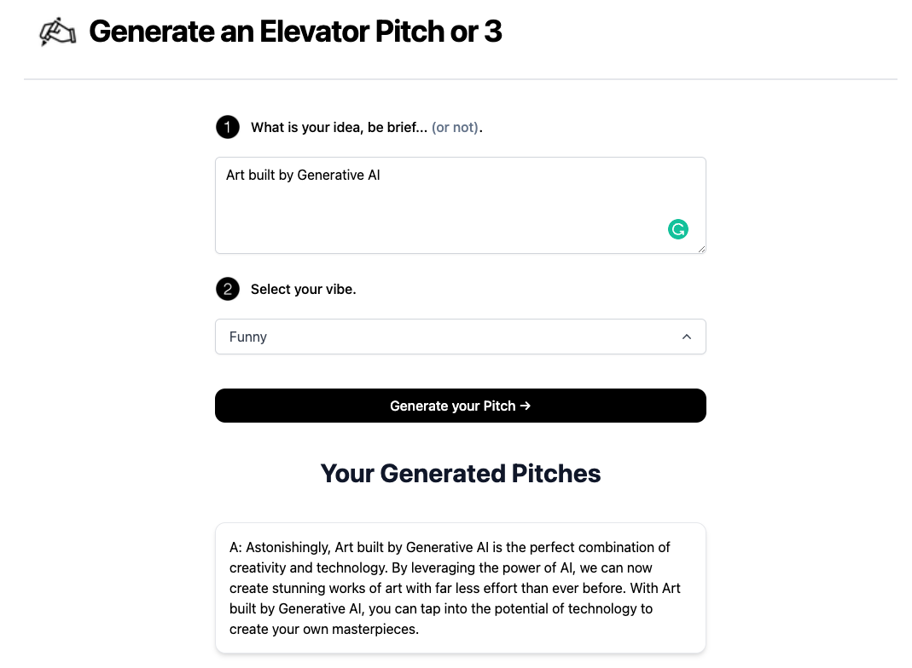

# [ConversationalX](https://Conversationalx.com)

This project generates Business Elevator Pitch ideas for you, using AI.

[](Private API Key - so no link at this point)

## How it works

This project uses the [OpenAI GPT-3 API](https://openai.com/api/) (specifically, text-davinci-003) and [Vercel Edge functions](https://vercel.com/features/edge-functions) with streaming. It constructs a set of prompts based on Prompt Engineering and user input, sends it to the GPT-3 API via a Vercel Edge function, then streams the response back to the application. It is based on the work of Nutlope (Hassan El Mghari) and the repository and code he created here:  https://github.com/Nutlope/twitterbio [Twitter Bios].

I am not a developer by trade, but have fun exploring. Using Vercel to build and modify this (and a few other applications0) has been a lot of fun! I will likely be making tweaks to the code and prompts as well (my area of focus).


## Running Locally

After cloning the repo, go to [OpenAI](https://beta.openai.com/account/api-keys) to make an account and put your API key in a file called `.env`.

Then, run the application in the command line and it will be available at `http://localhost:3000`.

```bash
npm run dev
```

## One-Click Deploy

Deploy the example using [Vercel](https://vercel.com?utm_source=github&utm_medium=readme&utm_campaign=vercel-examples):

[](https://vercel.com/new/clone?repository-url=https://github.com/mjayliebs/elevatorpitch&env=OPENAI_API_KEY&project-name=elevatorpitch&repo-name=elevatorpitch)
